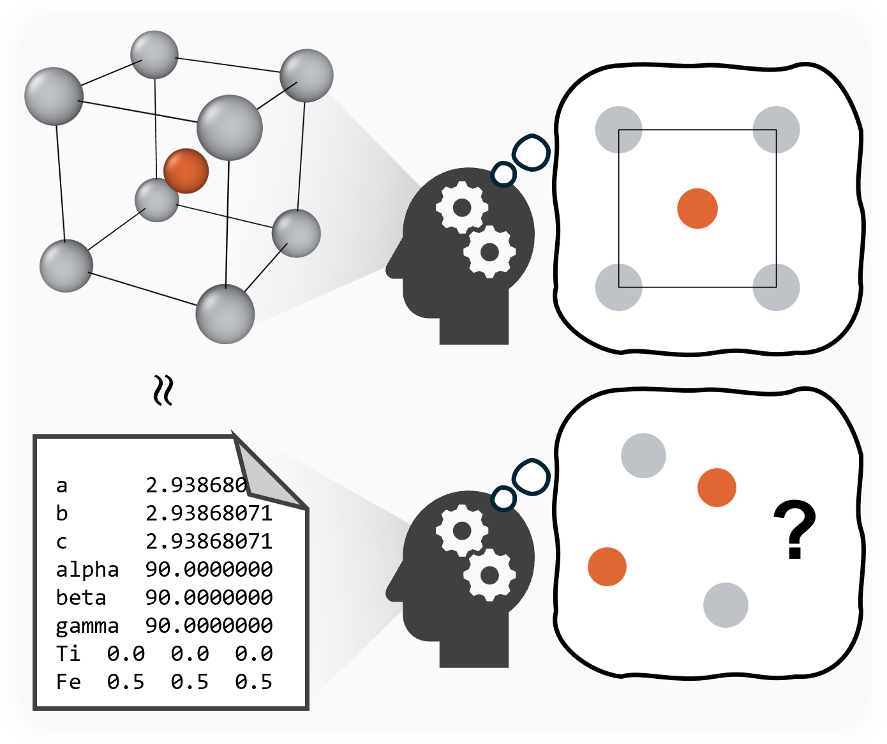

# Atom World

Testing LLMs' ability on operating 3D atomic structures.

<p align="center">
  
</p>


> *"Forget the messy details, I just need a model that can play Lego with atoms."* ⚛️🤖


---

## Table of Contents

- [Installation](#installation)
- [Usage of the Bench](#usage)
  - [Run the Benchmark](#run-the-benchmark)
    - [Available Benchmarks](#available-benchmarks)
    - [Available Actions](#available-actions)
    - [StructProp Task](#structprop-task)
  - [Analyze the Results](#analyze-the-results)
  - [Construct Your Own Data](#construct-your-own-data-with-mp-api)
- [Usage of the Gym]
  - under construction
- [Contributing](#contributing)
- [License](#license)
- [Citation](#citation)


---

## Installation

```bash
pip install -e .
```

---

## Usage of the Bench

If you want to run the benchmark for your own model, implement your model in `src/models/` and corresponding parameters in `config/models.yaml`. Currently, we have implemented openai_model, azure_openai_model, huggingface_model, and vllm_model.

### Run the Benchmark

```bash
python ./src/run_benchmark.py -t [benchmark_type] -m [model_name] -a [action_name] -b [batch_size] -n [num_batch]
```

**Arguments:**

| Argument         | Description                                                                 |
|------------------|-----------------------------------------------------------------------------|
| `benchmark_type` | Benchmark to run. See [Available Benchmarks](#available-benchmarks).        |
| `model_name`     | Model to test (e.g., `deepseek_chat`).                                  |
| `action_name`    | Action to test (see [Available Actions](#available-actions)). Only for AtomWorld and PointWorld. |
| `batch_size`     | Number of parallel LLM calls (default: 50).                                 |
| `num_batch`      | Number of batches to test (default: all data).                              |
| `--repeat`       | Repeat each frame/task this many times (default: 1).                        |
| `results_folder` | Optional output directory override. Otherwise a timestamped folder is created. |
| `restart_from_index` | Resume an interrupted job starting from the provided index. |
| `--plot`         | Produce a max-dist histogram after evaluation (AtomWorld, PointWorld, CIFGen). |
| `--data_path`    | Override the default dataset location. For AtomWorld/PointWorld/CIFGen pass a folder; for CIFRepair pass a CSV file. |
| `--input_cifs_file` | (AtomWorld only) Alternate `input_cifs` HDF5 filename to load from the data path. |

Use `--repeat` when you need multiple independent generations per frame. For example, `--repeat 10` will call the LLM ten times for every input frame while preserving the frame index in the output CSVs.

---

#### Available Benchmarks

- `atomworld`: AtomWorld
- `pointworld`: PointWorld
- `cifgen`: CIFGen
- `cifrepair`: CIFRepair

> For the StructProp task, see below.

---

#### Available Actions

**AtomWorld:**

- add_atom_action
- change_atom_action
- delete_around_atom_action
- delete_below_atom_action
- insert_between_atoms_action
- move_around_atom_action
- move_atom_action
- move_selected_atoms_action
- move_towards_atom_action
- remove_atom_action
- rotate_around_atom_action
- swap_atoms_action

**PointWorld:**

- move
- move_towards
- insert_between
- rotate_around

---

#### Use custom datasets

Pass `--data_path` to point the runner at your own dataset without changing the existing directory layout. The flag is benchmark-agnostic:

- **AtomWorld / PointWorld**: provide a folder that contains the CSV/HDF5 pairs (and optional `input_cifs` file). When `--data_path` is set you can also supply action names that are not in the built-in lists (e.g., `insert_between_atoms_action_natoms`).
- **CIFGen**: provide a folder containing your `.cif` files plus the accompanying `description_cards.json`.
- **CIFRepair**: provide the path to a CSV file with the `original_cif`, `modified_cif`, and `removed_value` columns.

For AtomWorld-specific datasets you can additionally set `--input_cifs_file` to choose a different HDF5 file that stores the base `input_cifs` mapping.

Example (PowerShell) using a custom AtomWorld dataset stored under `./data/analysis_data`:

```powershell
python .\src\run_benchmark.py -t atomworld -m deepseek_chat -a insert_between_atoms_action_natoms --data_path .\src\data\analysis_data --input_cifs_file analysis_input_natoms.hdf5
```

---

### StructProp Task

To get CIFs from LLM for StructProp:

```bash
python ./src/struct_prop_bench/inferring.py -m [model_name] -p [property] -b [batch_size] -n [num_batch]
```

Then run your own calculation pipelines. The results should be saved with the format similar to `./results/StructPropBench/dft_statistics.csv` in order to use the `./src/scripts/analyze_structprop_results.py` for final metrics. Or you can modify the analysis script for your own results.

---

### Analyze the Results

In the new codes, the results are saved in `./results/[BenchmarkType]/[ModelName]/[ActionName]/[Timestamp]/`. The `evaluation_results.csv` contains the correct results, and `evaluation_wrongs.csv` contains the incorrect ones. `metrics.json` contains the summary of the metrics. Every record now includes a `frame_index` (and `repeat_index`) column so you can group statistics per original dataset frame, especially when running with `--repeat > 1`.


Plotting after evaluation
------------------------

You can now request an automatic max_dist histogram to be generated after a benchmark run by adding the `--plot` flag to `run_benchmark.py`. The runner supports plotting for `atomworld`, `pointworld`, and `cifgen` benchmarks. The plot is saved to the same results folder as `evaluation_results.csv` and will not open an interactive window by default.

Examples:

```powershell
python .\src\run_benchmark.py -t atomworld -m deepseek_chat -a move_atom_action -b 10 -n 1 --plot
python .\src\run_benchmark.py -t cifgen -m deepseek_chat -b 10 -n 1 --plot
```


---

### Construct Your Own Data with mp-api

**The actions and data_generator are currently under refactoring.** The current pipeline will be updated soon. If you want to construct your own data, you can follow the steps below:

1. (Optional) Download random structures:
	```bash
	python src/scripts/download_random_mp_data.py --api_key [YOUR_API_KEY] --out_path [path] --min_natoms [min_atoms] --max_natoms [max_atoms] --num_entries [total_entries]
	```
    The input CIFs we used are available in `./src/data/input_cifs.zip`.
2. Generate data:
	```bash
	python src/atom_world/data_generator.py
	```
3. Convert to h5:
	```bash
	python src/scripts/convert_cifs_to_h5.py
	```
4. Put the generated [action_name].csv and [action_name].h5 files in `./src/data/`. Then you can run the benchmark with your own data.
---


## Contributing

Contributions are welcome! Please open an issue or submit a pull request for any improvements or bug fixes.

## License

This project is licensed under the MIT License. See the [LICENSE](LICENSE) file for details.

## Citation
```
@misc{lv2025atomworldbenchmarkevaluatingspatial,
      title={AtomWorld: A Benchmark for Evaluating Spatial Reasoning in Large Language Models on Crystalline Materials}, 
      author={Taoyuze Lv and Alexander Chen and Fengyu Xie and Chu Wu and Jeffrey Meng and Dongzhan Zhou and Bram Hoex and Zhicheng Zhong and Tong Xie},
      year={2025},
      eprint={2510.04704},
      archivePrefix={arXiv},
      primaryClass={cond-mat.mtrl-sci},
      url={https://arxiv.org/abs/2510.04704}, 
}
```
